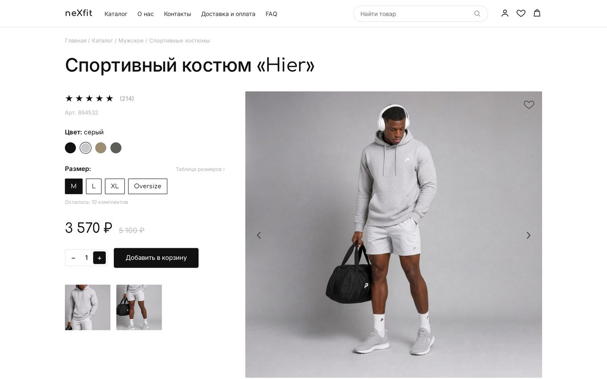

# NEXFIT — карточка товара «Hier»

🔗 Демо: https://nexfit-nu.vercel.app



## О проекте

Карточка товара интернет-магазина спортивной одежды: мужской костюм «Hier», худи плюс шорты. Сделано как живая страница из крупного магазина — со всеми механиками выбора и покупки, но с упором на одну сильную скролл-сцену, которая держит внимание. Целит в аудиторию, привыкшую к маркетплейсам: сразу размер, цвет, кнопка.

Верх экрана — рабочая карточка: галерея со стрелками и превью, выбор цвета свотчами, размеры, степпер количества, «в корзину» со счётчиком, «в избранное», табы «Описание / Характеристики / Уход». Дальше — фирменная пин-секция «СОЗДАН ДЛЯ ДВИЖЕНИЯ», лента «то, что вы смотрели», преимущества 01–03, отзывы с рейтингом и гигантский nexfit в подвале.

## Структура проекта

```
nexfit/
├── index.html      # разметка: хедер, карточка товара, табы, пин-секция, отзывы, футер
├── styles.css      # все стили карточки и секций, адаптив
├── app.js          # интерактив карточки: галерея, цвета, размеры, кол-во, корзина, табы
├── scroll.js       # скролл-анимации на GSAP ScrollTrigger (см. ниже)
├── assets/         # hero, motion-кадр, превью товаров, миниатюры
└── preview.jpg     # скриншот для превью
```

## Как это работает

Логика разнесена на два файла — «механика карточки» и «скролл-кино»:

- **`app.js`** — галерея с плавной сменой кадра (стрелки + миниатюры), свотчи цвета (название цвета меняется на лету), выбор размера, степпер количества, «в корзину» со счётчиком и pop-анимацией бейджа, кнопка «в избранное», переключение табов. Плюс `fitFooterType()` — масштабирует слово «nexfit» точно по ширине экрана.
- **`scroll.js`** — анимации на **GSAP ScrollTrigger** поверх **Lenis**:
  - **Пин-сцена «СОЗДАН ДЛЯ ДВИЖЕНИЯ»** — один scrub-таймлайн на весь сценарий: слова собираются снизу → окно с фото раскрывается на весь экран через `clip-path` (без пересчёта layout) → слова улетают → проявляется подпись. Всё привязано к прогрессу скролла, поэтому сцена всегда доигрывает до конца.
  - **Описание по словам** — текст разбивается на `<span>` и проявляется по одному в стиле Apple.
  - **Карточки, перки, буквы nexfit** — fade-in и выезд по скроллу.
  - Учитывается `prefers-reduced-motion` — для тех, кому анимации мешают, всё отключается.

## Стек

HTML / CSS / нативный JS · **GSAP + ScrollTrigger** (пин-сцена, clip-path reveal) · **Lenis** (плавный скролл) · шрифты **Inter / Comfortaa**. Библиотеки с CDN, сборка не нужна.

## Запуск и деплой

```bash
python -m http.server 8000   # из папки проекта
# http://localhost:8000
```

Открывать через локальный сервер (для корректной работы CDN-библиотек). Деплой — статикой на Vercel.
